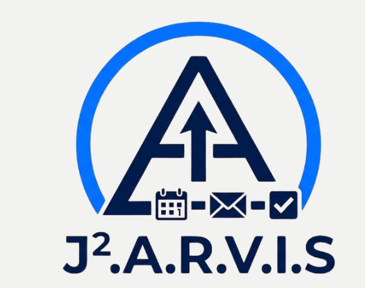
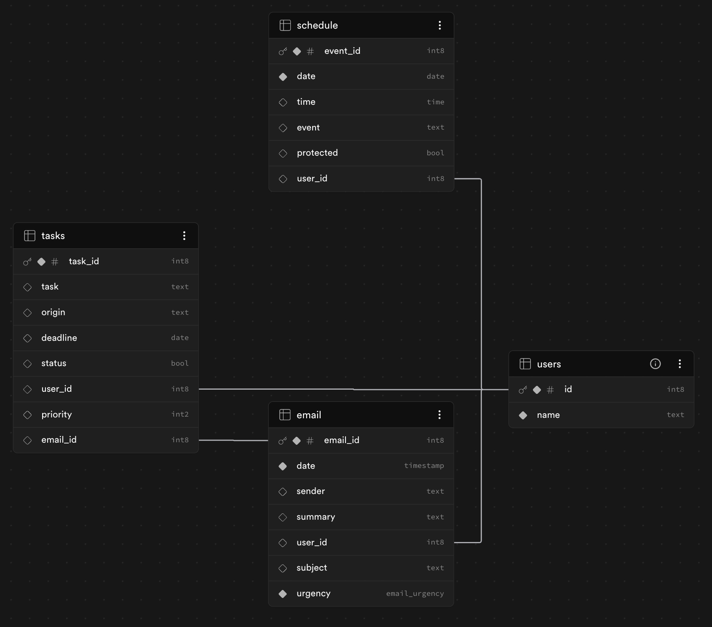
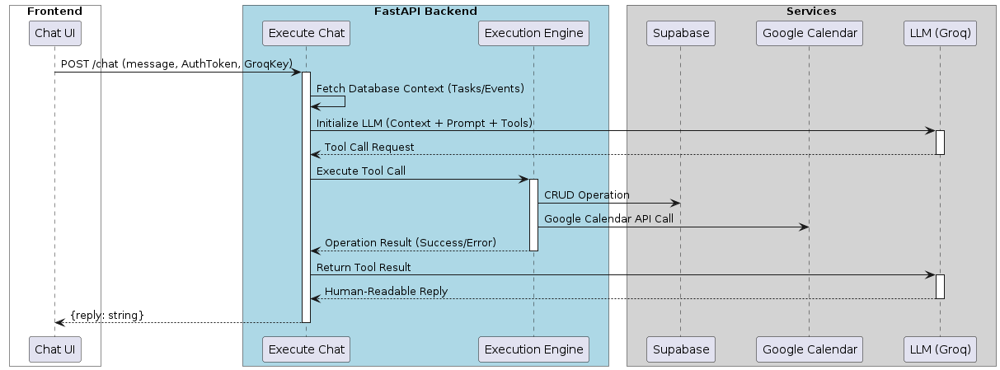

<div align="center">



# J².a.r.v.i.s
### Jason & Jadon's Reactive Virtual Intelligence System

**A proactive AI secretary that resolves your calendar conflicts, triages your tasks, and drafts your day — before you even open the app.**

[](https://github.com/yjenexd/Orbital-J.A.R.V.I.S/actions/workflows/ci.yml)
[](https://j2arvis-sigma.vercel.app/)
[](#license)


-F55036)

[Live Demo](https://j2arvis-sigma.vercel.app/) · [Figma Prototype](https://www.figma.com/make/bOvDGfwo1UTlOHdkWf8Uzj/J2.a.r.v.i.s.-Dashboard-Mockup) · [Report a Bug](https://github.com/yjenexd/Orbital-J.A.R.V.I.S/issues)

<!--
📸 ADD SCREENSHOT: Full dashboard view — the "Day at a Glance" AI briefing banner
sitting above the Task / Schedule / Calendar panels. This is the first thing a
new visitor should see. Save as docs/screenshots/dashboard.png, then swap the
line below in for this comment:


-->

</div>

---

## 😩 The Problem

University students burn **2–3 hours a week** just managing logistics across modules, project groups, internships and clubs. Notion and Google Calendar are passive — they store your schedule but won't resolve a conflict, prioritize a deadline, or notice you just double-booked yourself.

**J².a.r.v.i.s** is the opposite: a proactive agent that sits on top of Google Calendar and actually *does* something about the chaos.

---

## ✨ Features

- 💬 **One Chatbox, Every Action** — Create, update, and delete tasks or events with plain English. No forms, no menus, no drag-and-drop.
  > *"Change 'Test Sync' on 5 July to 4pm"* → done, synced to Google Calendar and Supabase in parallel.

- 🗓️ **Day-at-a-Glance Briefing** — Logs in, aggregates your schedule, tasks, and recent emails, and hands you a 5-sentence conversational summary with conflicts and urgent items flagged up front.

- ⚡ **Real Conflict Detection** — Interval-based overlap checks (`start < end` arithmetic, not just start-time matching) catch partial overlaps and midnight-spanning events, then ask for confirmation before writing anything.

- 🧠 **Task Triage Agent** — Every new task is scored 0–100 for urgency in the background via a non-blocking `FastAPI BackgroundTask`, so the UI never waits on an LLM call.

- 🔑 **True BYOK, Zero Server Liability** — Your Groq API key lives only in your browser's `localStorage`. It's injected per-request as a header, used to spin up an ephemeral client, and wiped from server memory the instant the response returns. If our database is ever breached, there is no key to leak — because it was never there.

- 🛡️ **Guardrails & LLM-as-a-Judge** — A LangGraph pipeline screens every input (chat, RAG-retrieved history, and database context) for prompt injection, validates output schemas, and routes failures to a tool-free retry node — so a rejected turn can never accidentally trigger a state-changing action.

- 🔍 **Grounded Recall (RAG)** — Chat replies are grounded in your own prior messages via a local `fastembed` + `pgvector` similarity search — no embedding API, no per-token cost, no third-party dependency.

<!--
📸 ADD SCREENSHOT: Chat interface mid-conversation, ideally showing a tool call
resolving (e.g. the overlap-confirmation prompt). Save as
docs/screenshots/chat-interface.png, then add:

<p align="center"></p>
-->

---

## 🚀 Quick Start

### Prerequisites

| Tool | Purpose |
|---|---|
| Node.js & npm | Frontend (React + Vite) |
| Python 3.12+ | Backend (FastAPI) |
| A [Groq API key](https://console.groq.com) | Powers chat, briefing & triage (BYOK — free tier available) |
| Supabase project + Google OAuth credentials | Ask the project owner, or spin up your own |

### 1. Backend

```bash
cd backend

# Create a virtual environment (Ubuntu/WSL: run `sudo apt install python3-venv` first if missing)
python3 -m venv venv
source venv/bin/activate        # Windows: venv\Scripts\activate

pip install -r requirements.txt
```

> [!WARNING]
> Keep the virtual environment **inside** `backend/`. Don't let your editor create a stray `.venv` at the repo root — if it does, delete it before installing anything.

Create `backend/.env`:

```env
SUPABASE_URL=your_supabase_url
SUPABASE_KEY=your_supabase_key
GOOGLE_CLIENT_ID=your_google_client_id
GOOGLE_CLIENT_SECRET=your_google_client_secret
GOOGLE_REFRESH_TOKEN=your_google_refresh_token
# GITHUB_TOKEN=ghp_your_token_here   # legacy: only needed for the old GitHub Models routing path
```

Run it:

```bash
python main.py
```

> [!TIP]
> VS Code showing "missing import" errors? Open the Command Palette (`Ctrl/Cmd+Shift+P`) → **Python: Select Interpreter** → pick `./backend/venv/bin/python` (or `.\backend\venv\Scripts\python.exe` on Windows).

### 2. Frontend

In a second terminal:

```bash
cd frontend
npm install
```

Create `frontend/.env`:

```env
VITE_API_URL=http://localhost:8000
```

```bash
npm run dev
```

### 3. Connect your Groq key

Once the app is running, open the **Profile** tab and paste in a key from [console.groq.com](https://console.groq.com) — it's validated live against the Groq API and stored only in your browser.

---

## 🛠️ Usage

Once you're logged in and signed into Google Calendar, everything runs through the chatbox:

```text
> Add a meeting called "Design Review" for 5 July at 2pm
✓ Created in Google Calendar and synced to Supabase.

> Change "Design Review" on 5 July to 4pm
✓ Updated — checked for conflicts first, none found.

> What's overdue?
→ Returns your task list sorted by AI-calculated priority, overdue items pinned to the top.

> Delete "Design Review" on 5 July
✓ Removed from both Google Calendar and the schedule table.
```

If a request overlaps an existing event, is ambiguous, or is missing a parameter, J.a.r.v.i.s asks a clarifying question instead of guessing — it's built to never fabricate a success it didn't actually perform.

---

## 🏗️ Architecture

Three layers, strictly separated: **React** owns rendering, **FastAPI** owns business logic and orchestration, **Supabase** owns persistence and auth.

<p align="center">
  
  <br/><sub>Relational schema — cross-referenced via <code>email_id</code> and <code>gcal_event_id</code> foreign keys</sub>
</p>

Every chat turn runs through a LangGraph pipeline: **input guardrail → RAG retrieval → generation → output guardrail → LLM judge**, with failed turns routed to a tool-free retry node so a rejected response can never trigger a real mutation.

<p align="center">
  
  <br/><sub>Chat → tool call → CRUD execution → grounded reply</sub>
</p>

<details>
<summary><strong>More sequence diagrams</strong> (BYOK flow, Task Triage, LLM Guardrails, RAG)</summary>
<br/>

| Flow | Diagram |
|---|---|
| BYOK key lifecycle | [`out/diagrams/BYOK/BYOK.png`](out/diagrams/BYOK/BYOK.png) |
| Task Triage Agent | [`out/diagrams/taskTriage/taskTriage.png`](out/diagrams/taskTriage/taskTriage.png) |
| LLM Guardrails & Judge | [`out/diagrams/LLM Guardrails/LLM Guardrails.png`](<out/diagrams/LLM Guardrails/LLM Guardrails.png>) |
| LangGraph RAG | [`out/diagrams/LangGraph/LangGraph.png`](out/diagrams/LangGraph/LangGraph.png) |

Source `.puml` files live in [`diagrams/`](diagrams/).

</details>

---

## 🧰 Tech Stack

| Layer | Stack |
|---|---|
| **Frontend** | React · TypeScript · Vite · FullCalendar |
| **Backend** | Python · FastAPI · LangGraph · LangChain |
| **AI / Inference** | Groq (BYOK, OpenAI-compatible SDK) · `fastembed` local embeddings (ONNX, all-MiniLM-L6-v2) |
| **Data** | Supabase (Postgres + `pgvector`) · Google Calendar API v3 · Google OAuth 2.0 |
| **Testing** | Pytest (backend) · Vitest (frontend) · a dedicated retrieval-accuracy eval harness |
| **CI/CD** | GitHub Actions → Vercel (frontend) · Render (backend), auto-deployed on merge to `main` |

---

## ✅ Running Tests

```bash
# Backend
cd backend && pytest tests/ -x -q

# Frontend
cd frontend && npm test
```

Frontend tests cover task priority normalisation, Groq key format validation, schedule time/overlap computations, and the `fetchWithGroqKey` API helper. Backend tests cover the chat tool path, guardrail routing, and a fixed retrieval-accuracy dataset — all run automatically on every push via [`ci.yml`](.github/workflows/ci.yml).

---

## 🩺 Troubleshooting

| Symptom | Fix |
|---|---|
| Blank UI on Vercel | Confirm `VITE_API_URL` is set in Vercel env vars, then redeploy |
| "Bad Gateway" / "System offline" | Backend isn't running, or `backend/.env` is misconfigured |
| Deploy fails on Render | Check all required env vars are set in the Render dashboard |
| UI looks broken | Run `npm install` — `@mui/material` may not have installed |

---

## 🤝 Contributing

1. Branch off `main` with a descriptive name (`feat/...`, `fix/...`, e.g. `gcal-integration`, `date-bugfix`).
2. Keep commits atomic; write PR titles that summarise intent.
3. Every PR needs both contributors assigned for shared ownership, and must pass the `ci.yml` pytest + TypeScript/Vitest checks before merge.
4. No direct pushes to `main` — everything lands via reviewed Pull Request.

## 📄 License

MIT — see [`LICENSE`](LICENSE) *(add a `LICENSE` file to the repo root to make this badge and link live)*.

---

<div align="center">

Built by **Jason & Jadon** for NUS Orbital 2026 · Proposed level: **Apollo 11**

[GitHub](https://github.com/yjenexd/Orbital-J.A.R.V.I.S) · [Project Log](https://docs.google.com/spreadsheets/d/17LiVK_4Txk1Xv3XGabHczf8yFwTnDMLH68qmtpckFUw)

</div>
